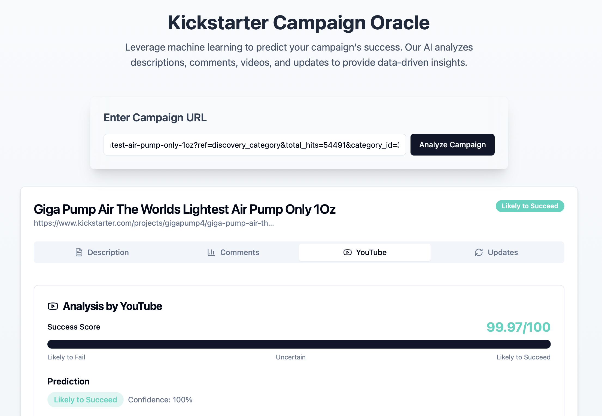

# Crowdfunding Analysis

**Analysis on Crowdfunding Platform Kickstarter Campaigns**

Despite the transformative role of crowdfunding platforms like Kickstarter in launching creative projects, predicting whether a campaign will succeed remains a significant challenge. Most people—including creators and backers—struggle to forecast outcomes accurately due to the inherent uncertainty of consumer behavior, limited pre-launch information, and the complex interplay of various campaign factors. This unpredictability often leads to inefficient resource allocation and missed opportunities, emphasizing the need for better predictive tools and strategies.

Existing literature and existing solutions focus on analyzing campaigns via quantitative metrics—number of backers, pledge amounts, funding velocity, etc.—but these methods can’t capture the full story. While early pledge momentum and total backers strongly correlate with final funding, they overlook the rich narrative and community signals embedded in a campaign’s text and updates. For instance, Mollick (2014) shows that “personal networks and underlying project quality” are just as predictive of success as funding‐rate metrics, suggesting that purely numerical models omit key drivers of backer behavior. A semantic text‐analytics study went further, demonstrating that “combining topical features with common numerical features” improved success‐prediction accuracy by over 10% compared to numbers‐only models. And in the most recent work, a multimodal model incorporating text, video metadata, and backer comments achieved state-of-the-art performance—underscoring the added value of qualitative signals alongside traditional KPIs. Yet despite these advances, crowdfunding platforms still surface only basic dashboards of backer counts and pledged sums, leaving creators without the deeper textual insights that could guide more effective storytelling and outreach.

As such our team have decided to create a tool to help people with the analysis of the success probability for Kickstarter Campaigns. In particular, we aim to build the website such that it would scrape live information from various sources and analyse it for them. On top of that, we decided to focus on a mixture of qualitative and quantitative metrics, emphasizing on textual data, rather than solely on numerical metrics. We believe that textual data (if properly trained and cleaned) would be able to provide more information our models can extract which could in turn open up more insights into how well the campaign is doing. Our tool would analyse the following aspects of the campaign:

- Campaign Description 
- Campaign Comments (within Kickstarter platform)
- Campaign Updates (within Kickstarter platform) 
- YouTube Comments (of the campaign)

For ease of development, we decided to split up the analysis of the different aspects of a campaign into individual models and datasets which would then be combined with each other in the final website.

---

### How-To Guide 
Concurrently do the following, 

- Run the `server.py` in `/backend/`: 
    * `python server.py`
- Run the `streamlit_script.py` in `/description-training/`: 
    * `streamlit run streamlit_script.py`
- Run the React app in `/frontend/`: 
    * `npm install; npm run dev`

--- 

### Google drive
Google drive contains the slides to this project, other data files/ML models weights that are too large to include in this repository. 
- https://drive.google.com/drive/folders/1nNBYgmNTUzqYLZRAaKSopzQk64Gfy0Sg?usp=sharing

### Final Report 
Look through the final report to look at what we have done over the past semester for this project. 
- https://docs.google.com/document/d/13zNSj3JyLAkQQjs6bXhFWpXcrIND-nVg/edit

