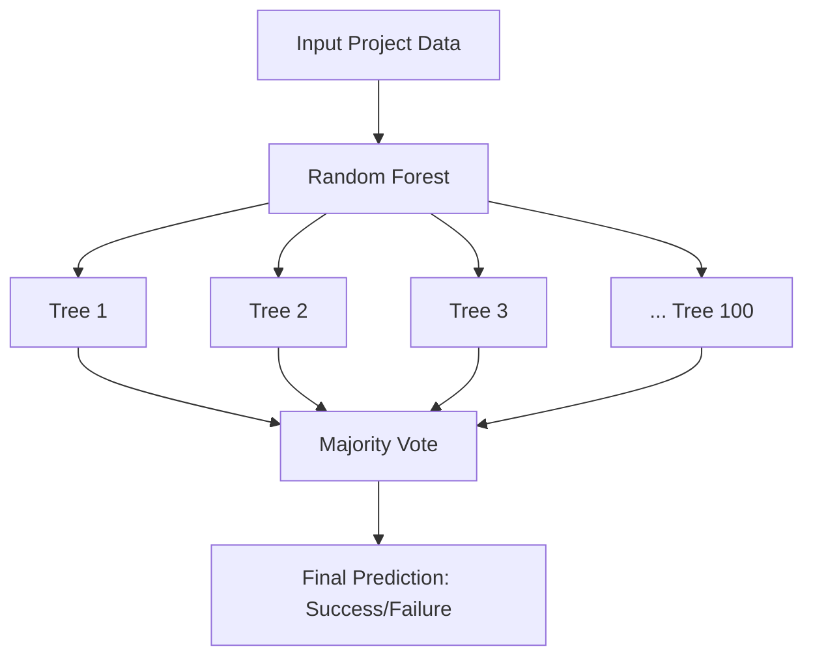

# Kickstarter Project Success Prediction Analysis

This analysis uses machine learning (Random Forest) to predict Kickstarter project success based on project updates and engagement metrics.

## Overview

The analysis processes Kickstarter project data from a single source:
- Project data: `../webscraper/scrapers/scraped_data/`

The code automatically determines whether a project was successful or failed based on whether the pledged amount meets or exceeds the funding goal.

## Example of Text Analysis

Here's how the model analyzes project updates. Consider this example update:

```
Dear Backers,
As we enter the final 48 hours of our Kickstarter campaign for the Morfone Electric Minoxidil Atomizer, 
we want to take a moment to sincerely thank you for your incredible support. Your backing has brought 
us this far, and we are incredibly grateful. 🙏✨

Thank You: Every step of this journey has been made possible by your trust and support. Thanks to 
wonderful backers like you, we're closer than ever to making our vision a reality. 🌟
...
```

The TF-IDF analysis identifies important words and their patterns:
- "Backers" (3.87% importance): Direct community engagement
- "support" (2.14% importance): Acknowledgment of backer contribution
- Words like "thank you", "grateful": Appreciation indicators
- Use of personal pronouns ("our", "your"): Community building
- Emoji usage and friendly tone: Engaging communication style

These patterns, combined with numerical metrics (likes, comments), help predict project success.

## Implementation Details

### 1. Data Loading and Feature Extraction

#### Data Loading
- Reads JSON files from the project directory
- Labels projects (1 for success, 0 for failure)
- Combines all projects into a single dataset

#### Feature Extraction
```python
Numerical Features:
- num_updates: Total number of updates
- total_likes: Sum of likes on all updates
- total_comments: Total number of comments
- total_comment_count: Comment count from metadata
- funding_duration: Campaign length in days
- updates_per_day: num_updates / funding_duration

Text Features:
- Processes all update content using TF-IDF
- Extracts 100 most important words/phrases
```

### 2. Random Forest Implementation

The model uses scikit-learn's RandomForestClassifier with 100 trees to predict project success.

#### How it Works



#### Tree Building Process
1. **Bootstrap Sampling**
   - Each tree uses ~63% of projects randomly
   - Remaining ~37% used for internal validation

2. **Feature Selection**
   - At each split, considers sqrt(106) ≈ 10 random features
   - Picks best feature for splitting

3. **Decision Making Example**
   ```
                    Root
                     |
       funding_duration > 30?
           /            \
          Yes           No
          /              \
   total_likes>50?    word_backers>0.2?
       /     \           /        \
   Success Failure   Failure    Success
   ```

### 3. Current Results

#### Model Performance
```
Accuracy: 73%
- Failed Projects: 81% accurate (26/32)
- Successful Projects: 66% accurate (23/35)
```

#### Top Influencing Factors
1. Campaign Duration (41.7%)
2. Total Likes (4.3%)
3. Word "backers" usage (3.9%)
4. Other engagement metrics and specific words

#### Confusion Matrix Interpretation
```
        Predicted
        0    1
Actual  0   26   6    (Failed Projects)
        1   12   23   (Successful Projects)

- True Negatives (26): Correctly predicted failures
- False Positives (6): Incorrectly predicted successes
- False Negatives (12): Incorrectly predicted failures
- True Positives (23): Correctly predicted successes
```

### 4. Usage

1. Install requirements:
```bash
pip3 install -r requirements.txt
```

2. Run the analysis:
```bash
python3 update_analysis.py
```

3. Check results in the generated `results_[timestamp]` directory:
- `analysis_summary.txt`: Detailed analysis report
- `feature_importance_readable.csv`: Feature rankings
- `feature_importance.png`: Visual representation of important features
- `confusion_matrix.png`: Model performance visualization

### 5. Advantages of this Implementation

1. **Robust Feature Processing**
   - Handles both numerical and text data
   - No need for feature scaling
   - Automatically handles missing values

2. **Random Forest Benefits**
   - Prevents overfitting through ensemble learning
   - Provides feature importance rankings
   - Handles non-linear relationships
   - Works well with mixed data types

3. **Interpretable Results**
   - Clear feature importance rankings
   - Visual representations
   - Detailed performance metrics

### 6. Potential Improvements

1. **Feature Engineering**
   - Add sentiment analysis of updates
   - Include update timing patterns
   - Analyze update images/media

2. **Model Tuning**
   - Optimize number of trees
   - Tune tree depth parameters
   - Adjust feature selection criteria

3. **Validation**
   - Implement cross-validation
   - Add confidence scores for predictions
   - Test on more recent projects

### 7. Interpretation Guide

The model should be used as one of many tools in evaluating projects:
1. High accuracy in predicting failures (81%)
2. Moderate accuracy in predicting success (66%)
3. Campaign duration is the strongest predictor
4. Engagement metrics and communication patterns matter
5. Regular, engaging updates correlate with success 